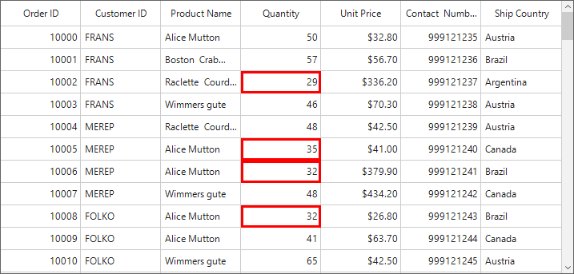

# How to change a particular cell border in WinForms DataGrid (SfDataGrid)?

## About the sample

This sample illustrates how to change color and thickness of particular cell border in WinForms DataGrid (SfDataGrid)

In [WinForms DataGrid](https://www.syncfusion.com/winforms-ui-controls/datagrid) (SfDataGrid) you can change the border color and thickness of the particular cells based on some condition by using [SfDataGrid.QueryCellStyle](https://help.syncfusion.com/cr/windowsforms/Syncfusion.WinForms.DataGrid.SfDataGrid.html#Syncfusion_WinForms_DataGrid_SfDataGrid_QueryCellStyle) event.

```C#

this.sfDataGrid1.QueryCellStyle += OnSfDataGrid1_QueryCellStyle;

private void OnSfDataGrid1_QueryCellStyle(object sender, Syncfusion.WinForms.DataGrid.Events.QueryCellStyleEventArgs e)
{
    if (e.Column.MappingName == "Quantity")
    {
        if ((e.DataRow.RowData as OrderInfo).Quantity < 40)
            e.Style.Borders.All = new Syncfusion.WinForms.DataGrid.Styles.GridBorder(Color.Red, Syncfusion.WinForms.DataGrid.Styles.GridBorderWeight.Thick);
    }
}

```



## Requirements to run the demo

Visual Studio 2015 and above versions